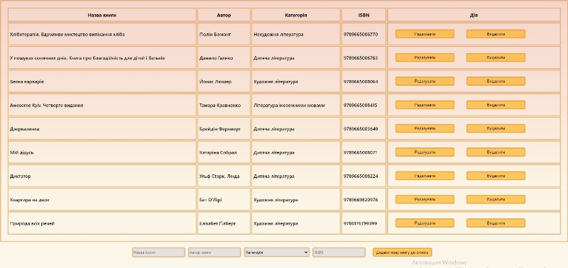

<h1 align="center">Books List</h1>

<a href="#"></a>


Books List is a table for adding and editing information about books.


---
- [Installation](#installation)
  - [Required to install](#Required-to-install)
  - [Clone](#Clone)
  - [Setup](#Setup)
  - [How to run local](#How-to-run-local)

---

## Installation

- All the `code` required to get started

### Required to install

- NodeJS (16.14.0)

### Clone

- Clone this repo to your local machine using `https://github.com/OleksandrSovynskyi/BooksList.git`

### Setup

> install sass packages

```shell
$ npm install sass
```

> install npm packages

```shell
$ npm install
```

> install JSON Server

```shell
$ npm install -g json-server
```

### How to run local

1. Open terminal.
2. Start JSON Server - `json-server --watch db.json`. Open http://localhost:3000/books to view it in the browser.
3. Open additional terminal and run project on port 3001 - `npm start`.


### Development team

[](https://github.com/OleksandrSovynskyi)
